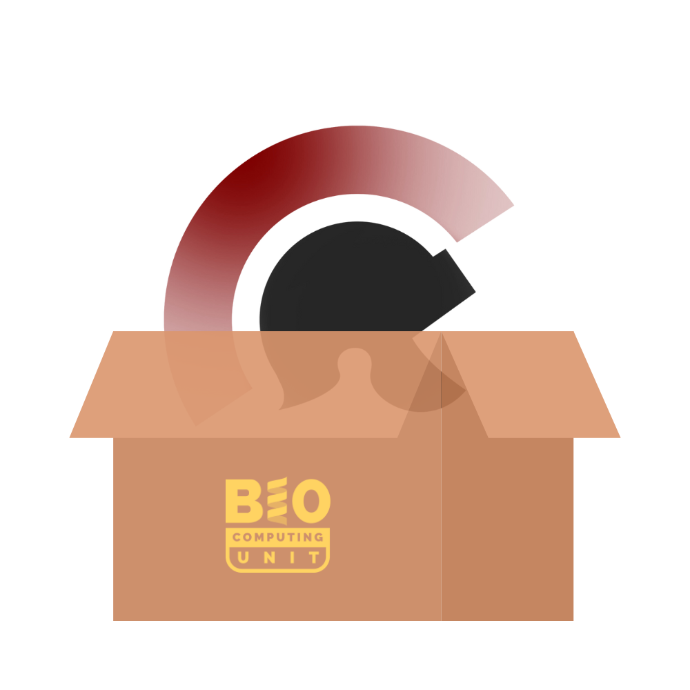

# scipion-containers

In this repository you will find a set of recipes to build containerised Scipion+Xmipp images for a hassle-free experience in CryoEM processing.

## Introduction
Whether you are a cluster or system administrator for a company or institution or a regular user aiming to do some processing in their own computer, scipion-containers can help you.

Installing and updating Scipion is as easy as it can be. Problems do come when populating the list of installed plugins: Xmipp, Relion, Sphire... Managing such a big environment can be a hassle.

That is why we offer a series of images and recipes to run Scipion and Xmipp from a virtualised environment. As of today, the available systems are **Docker** and **Apptainer/Singularity**.

## How to use
There are several ways to use containerised versions of Scipion and Xmipp. There are several pre-build and up-to-date images you can downoad from our harbor server. Alternatively, you can download the recipes from this repo, edit them as needed and generate your own images.
### Easy way - run the pre-built images
#### What are the available packages?
You can check it out in the [versions chart page](./available_images.md). You can use an image and its tag to download the image. All of the images use *scipion-base* as their foundation so there is no need of downloading it when downloading "add-on" packages such as *scipion-tomo*.
#### How to download it?
Our lab has set up an OCI registry (Harbor) in images.i2pc.es. It supports ORAS downloads for Apptainer and direct downloads for Docker. To download the *scipion-base* image on its tag *latest*, you could do:
##### Apptainer
```
apptainer pull oras://images.i2pc.es/scipion/scipion-base:latest
```
##### Docker
```
docker pull images.i2pc.es/scipion/scipion-base:latest
``` 
### Compiling and modifying your own images
All our recipes are included in the "apptainer" and "docker" subfolders of this GitHub project.

#### Apptainer/Singularity
Apptainer has an extensive [documentation](https://apptainer.org/docs/user/main/quick_start.html) that includes ways of opening, editing and recompiling SIF-formatted images such as ours.
#### Docker